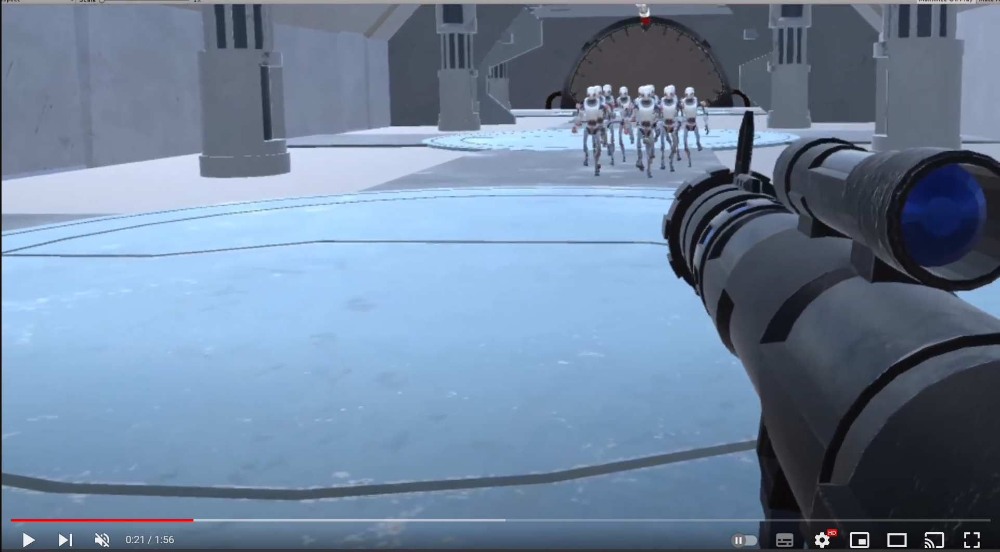

VR Shooter Kit
==============

VR Shooter Kit is a complete VR system, which contains a large number of components ready to be modified, to the needs of your own game, 
contains an example scene that contains a large number of components with which you can interact, levers, buttons, a lot of weapons that work in different ways, 
uzi, revolver, shotgun. Melee combat with swords, a complete damage system, enemies can take damage even if you just throw the weapons at them.

All the code is written in a clean and pleasant way, with comments so you don't miss anything, and each component has a lot of options, 
so that each part of your game behaves as you want.

Requires  Oculus Integration  or  SteamVR  (SteamVR Support in VR Shooter Kit still as BETA)

To get in contact with me, email me to platinio94@gmail.com or join our [Discord Channel](https://discord.gg/Naj5K5xXr5) 

[Youtube Video](https://www.youtube.com/watch?v=cEeg6_QdGYY) 

Installation
==============

Inside Assets/VRShooterKit/ you can find several installation guides as pdf depending on your target VR SDK, but before doing so all around VR Shooter Kit uses
[Git - Submodules](https://git-scm.com/book/en/v2/Git-Tools-Submodules) so you need to init the git modules using `$ git submodule init` and `$ git submodule update` 
after running those two git commands you are ready to go.
